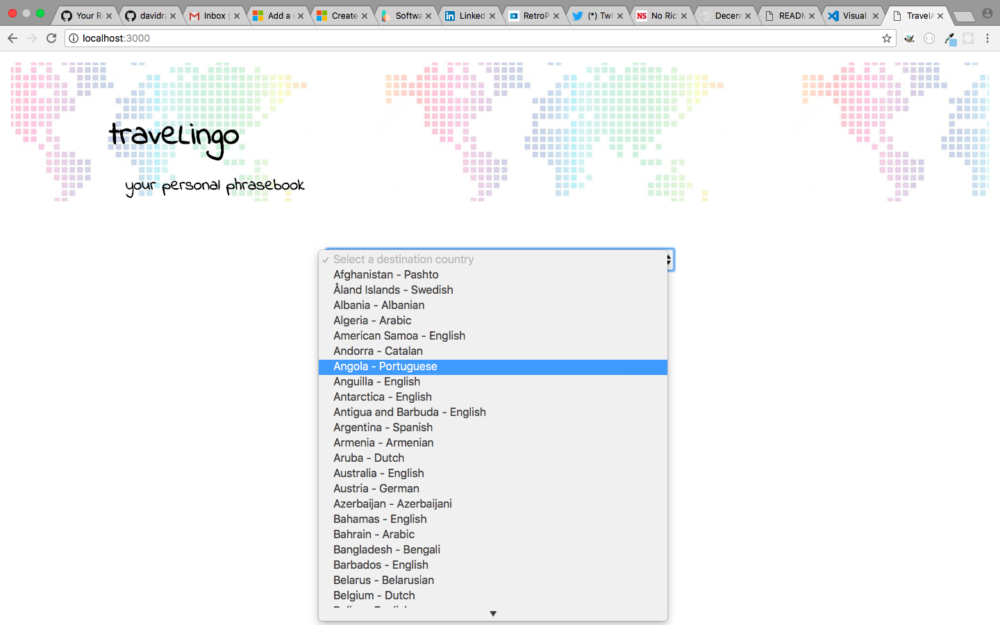
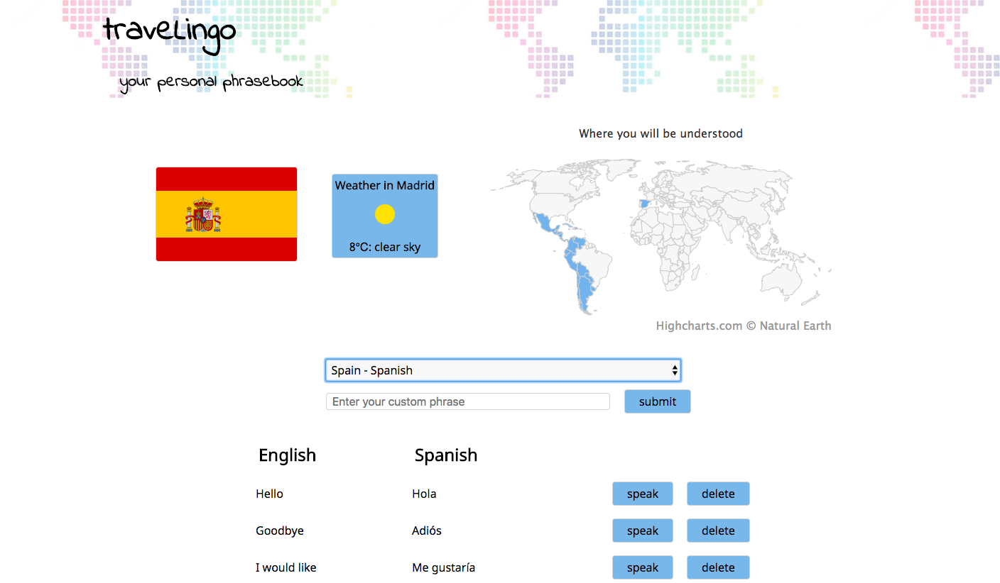
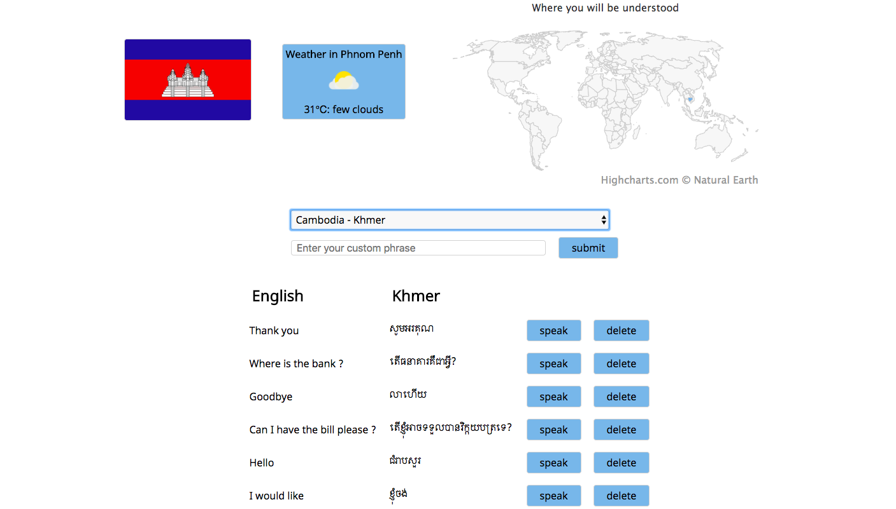

# Project Brief: Educational App

The BBC are looking to improve their online offering of educational content by developing some interactive apps that display information in a fun and interesting way.

Your task is to make an MVP to put forward to them - this may only be for a small set of information, and may only showcase some of the features to be included in the final app. You might use an API to bring in content or a database to store facts. The topic of the app is your choice, but here are some suggestions you could look into:

- Interactive timeline, e.g. of the history of computer programming
- Interactive map of a historical event - e.g. World War 1, the travels of Christopher Columbus

### MVP

- Display some information about a particular topic in an interesting way
- Have some user interactivity using event listeners, e.g to move through different sections of content

Some samples of existing apps for inspiration:

- http://chemistryset.chemheritage.org/#/
- http://www.royalmailheritage.com/main.php
- http://education.iceandsky.com/
- http://histography.io - may only work in Safari
- http://worldpopulationhistory.org/map/1838/mercator/1/0/24/


# Project Planning - Multi-Language Travel Phrase Web App


## MVP

### Welcome page
 - on 1st visit of app allows user to enter their name and home country

### Translation View
- Provide a drop down list of destination countries.  
- On country selection displays the country’s default language and top 10 travel phrases.
- Provide an option to save favourite country/language pairing & phrases for later use.


## Extensions

### Priority
- On subsequent visits to web app displays welcome greeting in home language e.g. “Bonjour Jean-Marie”
- Create a settings option to allow user to change name and home country
- User can enter their own phrase to translate and save if desired
- Map view showing visited countries / planned journeys
  - this could also be shown in the text version with a simple flag

### Consider
- User can set the display order of phrases
- Map interaction to show country information
- Text to speech output for pronunciation
- Local weather
- Local timezones


# Result - traveLingo








## Installation

- clone the repository
- cd into the new directory
- npm install
- sign up and request an API key from http://openweathermap.org/api
- inside your app, create the file ./client/resources/openweatherAPI.js
- add the following code:

```JavaScript

const openweatherAPI = {
  url: "http://api.openweathermap.org/data/2.5/weather?",
  key: "your_API_key_here"
}

module.exports = openweatherAPI;
```

### To actually start the app

- In your terminal: one tab per process, all run from the root directory of the project i.e. where server.js is found

```bash
> npm run webpack (builds bundle.js files)
> mongod (starts database)
> mongo (opens database)
> npm start
(a script to start the nodejs server using nodemon,
server listening on localhost:3000)
```

- **NB** closing the terminal does not stop the processes
- if you get an error when running any of those commands, check the Activity Monitor and kill any process that shouldn't be running
